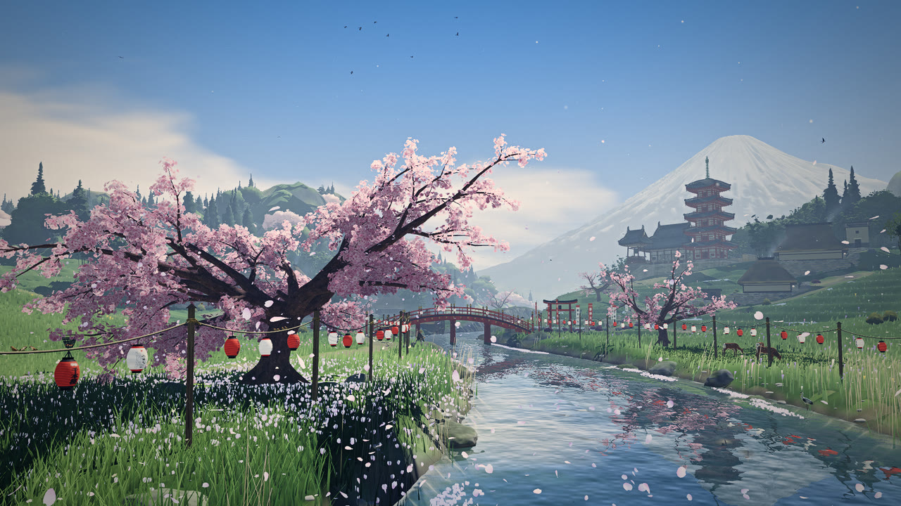

# Sakura River

A full-screen, interactive Three.js scene of a Japanese river valley in spring: a cherry tree in bloom by a river flowing from a Fuji-style mountain, a drum bridge, a farming village and rice terraces, a temple on a knoll. Deer graze, a heron fishes the shallows, a fisherman and a rice planter work, and birds, butterflies, koi and fireflies come and go with the hour. Seven weather presets combine with any time of day, and the lanes can be walked in first person.

Everything you see is generated in code: no image assets. The models are built by Blender scripts in `tools/`. The exceptions are the deer (ready-made models) and the sound (recordings); both are credited below.

Live: https://smolpaw.github.io/sakura-river/ (every push to `main` deploys).

## Develop

    pnpm install
    pnpm dev       # dev server at http://localhost:5173
    pnpm build     # dist/index.html, one self-contained file
    pnpm preview   # serve the build

The page must be served over HTTP to load the sounds (`dist/audio/`) and the walker's and the people's models (`dist/models/`). Opened as a file, it runs without them.

Rebuild generated assets with `node tools/blender.mjs [name]` (the Blender models; needs `blender` on the PATH or `BLENDER=`), `node tools/models.mjs` (the deer) and `node tools/audio.mjs` (the sounds; needs ffmpeg).

## Controls

Drag to look round, scroll or pinch to zoom, right-drag to pan. Buttons: Cinematic (a flight round the valley), Orbit, Walk and Reset view. In walk mode, W A S D or the arrow keys walk, the mouse looks (click to lock the pointer, Esc to release it), and Shift hurries. On touch screens, the left thumb walks and the right one looks.

Quality: Auto picks a tier and lowers the resolution under load; a tier picked by hand stays fixed. Frame rate: Auto runs at 60 fps and drops to 30 on slow devices; 60 and 30 hold that rate.

## Layout

- `index.html`, `src/style.css`, `src/ui.js`: the page and its controls.
- `src/main.js`: engine entry: renderer, scene assembly, camera modes, post chain, public API.
- `src/world.js`: terrain height field, river path, the village's paddies, lanes and building pads.
- `src/quality.js`: adaptive quality. `src/gen/`: worker pool for the generation done during loading.
- `src/tsl.js`, `src/materials.js`: shared shader nodes and the lit materials (TSL, compiled to WGSL and GLSL).
- `src/lods.js`, `src/impostors.js`: the instanced Blender models with their distance levels, culling and the woods' impostors.
- `src/lights.js`, `src/sunshadow.js`, `src/post.js`: the lamps' light map, the valley and cloud shadows, light shafts and the final grade.
- Scenery: `tree.js`, `blossoms.js`, `grass.js`, `vegetation.js`, `props.js`, `temple.js`, `village.js`, `wayside.js`, `lanterns.js`, `banners.js`, `boat.js`.
- Sky and water: `sky.js`, `weather.js`, `water.js`, `touches.js`, `petals.js`, `petalsgpu.js`, `fx.js`, `fireflies.js`.
- Animals and people: `koi.js`, `deer.js`, `heron.js`, `birds.js`, `perched.js`, `butterflies.js`, `figures.js`.
- Walk mode: `walk.js` (the path network and the input), `walker.js` (the traveller's body).
- `src/audio.js`: music and ambience.
- `src/models/`: models inlined in the page. `public/models/`: models fetched later (the traveller, the people at work, the Ultra tier's near models). `public/audio/`: sounds.
- `tools/`: model and audio build scripts. `bench/`: headless capture and timing scripts. `docs/performance.md`: renderer performance notes.

## Engine API

    import { create } from './src/main.js';   // also window.SakuraRiver.create
    const scene = await create(canvas, { quality, fixedQuality, frameRate, backend, hour, onProgress, onReady, onStats, onLost, onCinematicChange, onWalkChange });
    scene.setWeather(id, seconds);              // a preset from WEATHERS in src/weather.js
    scene.setTimeOfDay(hour, animate, forward); // 0..24, optionally as a time-lapse
    scene.timeOfDay();
    scene.set('wind' | 'petals' | 'river' | 'time' | 'fog' | 'bloom' | 'clouds' | 'rain' | 'lightning', value0to1);
    scene.setCinematic(on); scene.setAutoOrbit(on); scene.setWalk(on); scene.walking();
    scene.setSound(on); scene.setVolume('music' | 'nature', v); scene.soundWaiting();
    scene.setRenderScale(s);                    // 0.6..1
    scene.setFrameRate('auto' | 60 | 30);
    scene.resetCamera();
    scene.dispose();

- `quality` is `'ultra' | 'high' | 'medium' | 'low'`. When it is omitted, the engine picks a tier for the device, never Ultra. `fixedQuality` turns off the adaptive resolution. `backend: 'webgl'` forces WebGL2.
- `create` rejects with `code` `'unsupported'` (no WebGPU or WebGL2), `'stalled'` (shader preparation hung) or `'lost'` (device lost during start-up).
- The callbacks: `onProgress({ stage, f, quality, backend })` during loading, `onStats({ fps, quality, level, scale, floor })` about once a second, `onLost({ api, message, reason })` on a lost device.
- The handle also carries debug hooks for headless checks, commented where `src/main.js` returns it.

## Sound

The recordings come from the sources below, used under their licences. `tools/audio.mjs` lists the exact files and cuts. The files in `public/audio/` are edited from them: trimmed, looped, filtered and levelled. Files made from a share-alike (SA) source stay under that source's licence.

Music, by PeriTune (https://peritune.com), CC BY 4.0, unchanged apart from their tags:
- "Sakuya3": https://peritune.com/blog/2016/10/18/sakuya3/
- "Oboro": https://peritune.com/blog/2019/04/08/oboro/
- "Shizima4": https://peritune.com/blog/2021/06/06/shizima4/

Ambience:
- River: "Mountain stream #1" by Pierre Sibanarco, BigSoundBank, CC0. https://bigsoundbank.com/mountain-stream-1-s2754.html
- Breeze: "Wind in shrub" by Joseph Sardin, BigSoundBank, CC0. https://bigsoundbank.com/wind-in-shrub-s0907.html
- Gale: "Strong wind and trees #1" by Joseph Sardin, BigSoundBank, CC0. https://bigsoundbank.com/strong-wind-and-trees-1-s1450.html
- Thunder: "Thunder" recordings 2718, 3114, 3115, 3116, 3179, 3181 and 3182 by Joseph Sardin (3181 with Axeline T.), BigSoundBank, CC0. https://bigsoundbank.com (search "thunder")
- Heavy rain: "AMB Rain Loop 2" by Kresiek The Furry, OpenGameArt, CC0. https://opengameart.org/content/amb-rain-loop-2
- Drizzle: "Choishi Michi Trail Forest Rain and Birds Near Koyasan Japan" by Lawrence Dolton, radio aporee, CC BY-NC-SA 3.0. https://archive.org/details/aporee_69094_80175
- Birds: "Kamikosawa Canyon Forest Near Koyasan Japan - Forest Birds Quiet" by Lawrence Dolton, radio aporee, CC BY-NC-SA 3.0. https://archive.org/details/aporee_68851_79871
- Water under the bridge: "easy lapping of waves on the rocks-birds, White Sea, Russia" by Nikolaj Terent'ev, radio aporee, CC BY 3.0. https://archive.org/details/aporee_24924_28918
- Temple bell: "Mii-dera" (the evening bell of Mii-dera, Ōtsu), radio aporee, Public Domain Mark 1.0. https://archive.org/details/aporee_31518_36212
- Bush warbler: XC993079, Japanese Bush Warbler (*Horornis diphone*), Karuizawa, by Xavier Riera, xeno-canto, CC BY-NC-SA 4.0. https://xeno-canto.org/993079
- Waterwheel: "Watermill" by Pierre Sibanarco, BigSoundBank, CC0. https://bigsoundbank.com/mill-wheel-bladed-s2768.html
- Frogs: "1586 Dōbaru, Kokuraminami Ward, Kitakyushu, Fukuoka 803-0266, Japan - Frogs" by thomasmartinnutt, radio aporee, Public Domain Mark 1.0. https://archive.org/details/aporee_65287_75404
- The fisherman's tune (`fisher-*`; the humming lowered by three semitones): "Auld Lang Syne unmastered, whistles and hums" by fallbackcrush, Freesound, CC BY 4.0. https://freesound.org/people/fallbackcrush/sounds/413563/
- Bamboo: "Bamboo grove in Tsuji, Rittō City, Shiga Prefecture, Japan - Wind in Bamboo" by Greg Peterson, radio aporee, CC BY-SA 3.0. https://archive.org/details/aporee_43162_49194

Footsteps (every `step-*` file carries the geta recording's knock, so all of them are CC BY-SA 3.0):
- Geta: "Kamigyo Ward, Kyoto - wooden clogs" by OR poiesis, radio aporee, CC BY-SA 3.0. https://archive.org/details/aporee_25634_29691
- Boards: "Walk on Pontoon" by Joseph Sardin, BigSoundBank, CC0. https://bigsoundbank.com/walk-on-pontoon-s1845.html
- Earth: "Footsteps on Gravels #4" by Joseph Sardin and Axeline T., BigSoundBank, CC0. https://bigsoundbank.com/footsteps-on-gravels-4-s3216.html
- Grass: "Steps in the short grass" by Joseph Sardin, BigSoundBank, CC0. https://bigsoundbank.com/steps-in-the-short-grass-s0854.html

## Models

Every model except the deer is built by a Blender script in `tools/`, which describes what it builds at its top.

The deer come from the Ultimate Animated Animal Pack by Quaternius (https://quaternius.com/packs/ultimateanimatedanimals.html), CC0: "Deer" (the hinds) and "Stag", as served by Poly Pizza (https://poly.pizza/m/T6Cs7tmMHJ, https://poly.pizza/m/tQdzbZ1Cmw). `tools/models.mjs` trims their clips, bakes in their colours and subdivides them. `src/deer.js` reshapes them into sika deer and paints on their coats.
